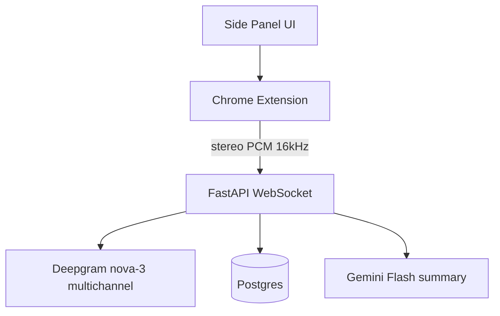

# Meet Dual-Stream Transcription

Chrome MV3 extension + FastAPI backend that captures **microphone** and **Google Meet tab audio** as separate stereo channels, transcribes them live via Deepgram multichannel streaming, and generates a Gemini meeting summary.

**[Interactive setup guide](https://edvardhov.github.io/meet-dual-stream-transcription/)** — step-by-step walkthrough with demo video.

## Architecture



- **Channel 0 (left):** local microphone
- **Channel 1 (right):** Meet tab audio (remote participants)
- One Deepgram WebSocket with `multichannel=true&channels=2` keeps a shared timeline for natural ordering.

## Prerequisites

- Docker + Docker Compose
- Node.js 20+ and pnpm
- Python 3.12+ (optional for local backend dev)
- API keys:
  - [Deepgram](https://console.deepgram.com/)
  - [Google AI Studio / Gemini](https://aistudio.google.com/apikey)

> `LLM_MODEL` defaults to `gemini-3.5-flash-lite`. Older names such as
> `gemini-2.5-flash` return `404 NOT_FOUND` for newly created API keys.

## Quick start

```bash
git clone <repo-url>
cd meet-dual-stream-transcription
cp .env.example .env
# edit .env with your API keys

docker compose up --build
```

In another terminal:

```bash
cd extension
pnpm install
pnpm build
```

### Load the extension in Chrome

1. Open **Chrome** and go to `chrome://extensions`.
2. Turn on **Developer mode** (toggle in the top-right corner).
3. Click **Load unpacked**.
4. In the file picker, select the **`extension/dist`** folder inside this repo  
   (the folder that contains `manifest.json` after `pnpm build` — not `extension/` itself).
5. Confirm the card shows **Meet Dual-Stream Transcription**. Pin it from the puzzle  
   icon in the toolbar if you want quick access to the popup.

After you change extension code, run `pnpm build` again, then click the **reload**  
(↻) icon on the extension card in `chrome://extensions`. Chrome keeps serving the  
previously loaded bundle until you reload.

### Live Meet workflow

1. Open a Google Meet call (`https://meet.google.com/...`).
2. Click the extension's toolbar icon to open the popup.
3. Click **Enable microphone**. A dedicated tab opens — choose **Allow while visiting this site** when Chrome asks (**Allow this time** will not work). Wait for the green "Microphone enabled" message before closing the tab.
   The side panel cannot show this prompt; if you skip Allow, Start will fail
   with "Permission dismissed".
4. **Join the call** (not the lobby or Meet home page). The Start button stays
   disabled until the extension detects in-call controls (Leave call / End call).
5. Open the side panel or popup and press **Start capture**.
   Capture only starts when `meet.google.com` is your **active** tab and you are
   **in an active meeting**.
6. The side panel shows live transcripts once capture is running.
7. Click **Summarize** when done. Capture stops automatically when you leave the
   call, navigate away from Meet, or close the Meet tab.

## Extension controls

| Control                      | Description                                                      |
| ---------------------------- | ---------------------------------------------------------------- |
| Popup → Enable microphone    | Primes mic permission for offscreen capture                      |
| Popup → Start/Stop capture   | Begins/ends dual-stream session                                  |
| Meet microphone mute         | Mute in Google Meet to stop local transcription                  |
| Toolbar badge `REC` / `MUTE` | Visible capture indicator (offscreen docs show no tab indicator) |
| Meet mute observer           | Best-effort sync; can degrade if Meet DOM changes                |

## Backend endpoints

| Method | Path                           | Purpose                                         |
| ------ | ------------------------------ | ----------------------------------------------- |
| POST   | `/api/sessions`                | Create session                                  |
| GET    | `/api/sessions/{id}`           | Snapshot (utterances + events + latest summary) |
| POST   | `/api/sessions/{id}/stop`      | Stop session                                    |
| POST   | `/api/sessions/{id}/summarize` | Generate/cache Gemini summary                   |
| WS     | `/api/sessions/{id}/stream`    | Binary PCM in, transcript JSON out              |
| GET    | `/health`                      | Health check                                    |

## Configuration

For Docker Compose, `.env` needs at least your API keys plus the database URL
(use `@db`, not `localhost`):

```env
DEEPGRAM_API_KEY=...
GEMINI_API_KEY=...
DATABASE_URL=postgresql+asyncpg://meet:meet@db:5432/meet_transcription
```

CORS accepts any Chrome extension origin automatically (`chrome-extension://<id>`).
You do not need to configure an extension ID in `.env`. Optional `CORS_ORIGINS`
adds extra web origins (comma-separated) if you add a browser client later.

## Development

### Backend tests

Install editable (`-e`), otherwise `pytest` imports a stale copy of `app/` from
site-packages instead of your working tree:

```bash
cd backend
python3.12 -m venv .venv && source .venv/bin/activate
pip install -e ".[dev]"
pytest
ruff check . && mypy app
```

### Extension tests

```bash
cd extension
pnpm test
```

### Setup guide site

```bash
cd site
pnpm install
pnpm dev
```

Built and deployed to GitHub Pages on push to `main` (see `.github/workflows/pages.yml`).
